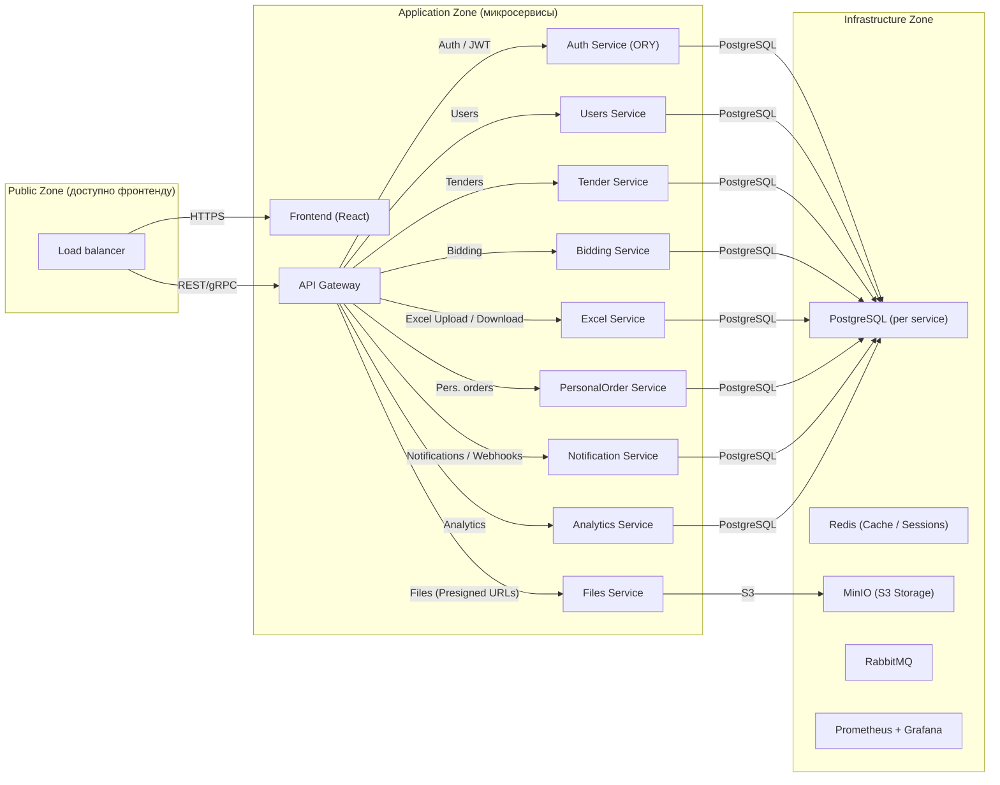

## Главный функционал

Администратор платформы (заказчик) загружает Excel-таблицу с необходимыми позициями и количеством каждой из них, после чего конфигурирует и публикует заказ. Опубликованный заказ становится доступен пользователям — поставщикам.

Поставщики могут предложить свои цены на поставку позиций. После сбора всех цен (или в момент, который определит администратор) запускается механизм торгов.

Во время торгов у поставщиков рядом с каждой предложенной ценой отображается индикатор, показывающий, является ли их цена лучшей среди конкурентов. На этом этапе поставщик может снизить свою цену, чтобы улучшить позицию.

После завершения торгов заказ закрывается для редактирования. Администратор анализирует результаты и автоматически формирует отдельные заказы для каждого поставщика, выбирая самые выгодные предложения.

Кроме того, администратор может гибко настроить процесс формирования персональных заказов: например, игнорировать предложения отдельных поставщиков или, наоборот, отдать предпочтение поставщику независимо от его цены.

## Технологии


- **ORY** — авторизация и управление доступом.  
- **PostgreSQL** — отдельная база данных для каждого сервиса.  
- **ClickHouse** — используется для хранения и анализа истории изменения цен.  
- **Redis** — кеширование и ускорение операций.  

Каждый сервис имеет классические REST-эндпоинты и, при необходимости, может взаимодействовать с другими сервисами через **gRPC**, **RabbitMQ** или **Kafka** в зависимости от задачи.

- **S3-хранилище** — загрузка и хранение Excel-файлов.

Деплой предполагается в **Kubernetes** или **Docker Swarm**, также поддерживается запуск через обычный **Docker Compose**.

- **Prometheus** и **Grafana** — сбор и визуализация метрик.

## Примерная архитектура


## Примерная структура репы

```
goodprice-tender-platform/
│
├── api-gateway/
|
├── frontend/
|
├── auth-service/
├── users-service/
├── order-service/
├── orderitems-service/
├── items-service/
├── pricing-service/
├── participant-service/
├── bidding-service/
├── excel-service/
├── files-service/
├── personal-orders-service/
├── notification-service/
├── analytics-service/
├── shared-go/                   #Возможно не будет
├── shared-python/
|
├── infra/                     
├── docs/
└── devtools/
```